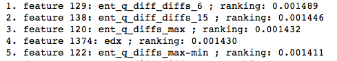
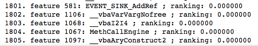

# Big Data Analytics HW1

#### Q1. 哪些屬性對於惡意程式分類有效?

（取前五個） ent_q_diff_diffs_6 ent_q_diff_diffs_15 ent_q_diffs_max edx ent_q_diffs_max-min 
圖片參考：

其他請參考 ipynb 中的執行成果

#### Q2. 哪些屬性對於惡意程式分類無效?

（取前五個） \__vbaAryConstruct2 MethCallEngine \__vbaI2I4 \__vbaVarVargNofree EVENT_SINK_AddRef 
圖片參考：

其他請參考 ipynb 中的執行成果

#### Q3. 用什麼方法可以幫助你決定上述的結論?

採用 Random Forest 這樣的 Desicion Trees Method 來估計 Feature 的重要性（n_estimators 的值設為 100）

#### Q4. 透過Python哪些套件以及方法可以幫助你完成上面的工作?

Pandas、Numpy、sklearn 的 ExtraTreesClassifier

#### Q5. 課程迄今有無建議?

無